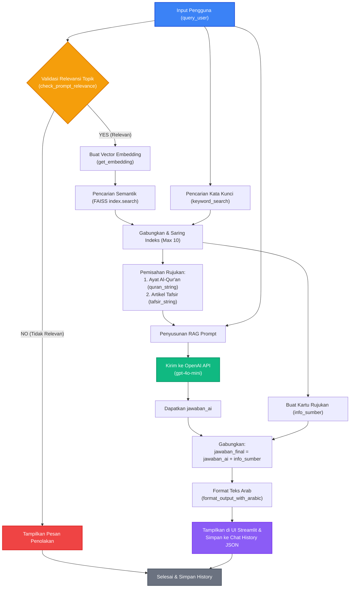

# Visualisasi Alur Jalannya Data (Data Flow) - Fitur Chatbot RAG

Dokumen ini menjelaskan visualisasi alur jalannya data (*data flow*) pada fitur utama chatbot RAG (Retrieval-Augmented Generation) yang terdapat pada file [app.py](file:///d:/CodeSkripsi/app.py) (khususnya pada blok input chat baris 375-525).

---

## 📊 Diagram Alur Data (Data Flow Diagram)

Berikut adalah visualisasi alur data menggunakan diagram Mermaid:

---

## 📥 1. Input

Sistem menerima beberapa input berikut untuk memulai proses:
1. **`query_user` (String)**: Teks pertanyaan yang diketik oleh pengguna pada input chat Streamlit (`st.chat_input`). Contoh: *"Bagaimana penjelasan tentang riba?"*.
2. **`openai_api_key` (String)**: Kunci akses OpenAI API yang diambil dari environment variable (`.env`), streamlit secrets, atau input manual di sidebar untuk melakukan autentikasi ke OpenAI.
3. **`index` (FAISS Index)**: Database vektor lokal berformat FAISS yang berisi embedding dari seluruh rujukan dokumen (ayat Al-Qur'an dan tafsir).
4. **`metadata` (List of Dictionary)**: List yang berisi data sumber dan teks asli dari dokumen rujukan yang sesuai dengan baris indeks FAISS.
5. **Model Embedding (`paraphrase-multilingual-MiniLM-L12-v2`)**: Model Sentence-BERT untuk mengubah teks pertanyaan menjadi vektor numerik berdimensi 384.
6. **Preprocessor (`ArabertPreprocessor`)**: Digunakan untuk membersihkan dan menormalisasi teks Arab jika query mengandung huruf Arab.

---

## ⚙️ 2. Proses (Step-by-Step)

Proses pengolahan data dibagi menjadi beberapa tahap terstruktur sebagai berikut:

### Tahap A: Validasi Relevansi (Guardrail Cost)
1. **Pengecekan Topik**: Sebelum memproses database lokal atau memanggil API utama, `query_user` dikirim ke fungsi `check_prompt_relevance`.
2. **Klasifikasi via LLM**: Fungsi ini mengirim prompt klasifikasi ke model `gpt-4o-mini` OpenAI untuk menentukan apakah pertanyaan berkaitan dengan topik Islam (Al-Qur'an, Tafsir, Hadits, sejarah, ibadah, dll).
3. **Pencabangan Logika**:
   - Jika responsnya **NO**, sistem langsung menampilkan pesan penolakan tanpa memproses pencarian dokumen, lalu menyimpan riwayat.
   - Jika responsnya **YES** (atau terjadi error koneksi yang dilewati sebagai default `True`), proses berlanjut ke tahap berikutnya.

### Tahap B: Ekstraksi Vektor (Vector Embedding)
1. **Deteksi Bahasa Arab**: Fungsi `get_embedding(query_user)` mendeteksi jika ada karakter Arab di dalam query. Jika ada, teks diproses melalui `preprocessor.preprocess()`.
2. **Tokenisasi & Inference**: Teks ditokenisasi dan dimasukkan ke model transformer MiniLM untuk menghasilkan token embeddings.
3. **Mean Pooling**: Embeddings tersebut di-pool menggunakan rata-rata (`mean_pooling`) untuk menghasilkan vektor representasi tunggal berdimensi 384.
4. **Normalisasi L2**: Vektor hasil pooling dinormalisasi L2 agar pencarian kemiripan kosinus (Cosine Similarity) di FAISS bekerja optimal.

### Tahap C: Pencarian Dokumen Relevan (Hybrid Search)
Sistem menggunakan pendekatan hibrida (*hybrid search*) untuk meningkatkan relevansi dokumen:
1. **Pencarian Semantik (FAISS)**:
   - Vektor query dimasukkan ke `index.search(query_vector, 5)`.
   - Mengembalikan 5 indeks dokumen dengan kemiripan semantik tertinggi.
2. **Pencarian Kata Kunci (Keyword Search)**:
   - Memanggil `keyword_search(query_user, metadata, k=5)`.
   - Memfilter stopwords bahasa Indonesia, lalu mencocokkan sisa kata kunci dengan teks dan judul sumber di `metadata` menggunakan regex. Memberikan skor bobot lebih tinggi (+2) jika terdapat pencocokan kata utuh (*word boundary*).
3. **Penggabungan & Deduplikasi**:
   - Indeks dari pencarian semantik dan kata kunci digabungkan (semantik diprioritaskan).
   - Duplikasi indeks dieliminasi menggunakan objek `set`.
   - Total rujukan dibatasi maksimal 10 rujukan teratas (`combined_indices[:10]`).

### Tahap D: Pemisahan Kategori Rujukan
1. Berdasarkan indeks yang terpilih, teks asli diambil dari `metadata`.
2. Dokumen dipisahkan berdasarkan nama sumbernya:
   - Jika sumber memiliki kata `"Al-Qur'an"`, teks dimasukkan ke dalam `quran_list`.
   - Jika tidak, teks dimasukkan ke dalam `tafsir_list` bersama dengan nama sumbernya.
3. Digabungkan menjadi dua string terpisah: `quran_string` dan `tafsir_string`.

### Tahap E: Konstruksi Prompt RAG & Pemanggilan API OpenAI
1. **Konstruksi Prompt**: Sistem menyusun `prompt_rag` dengan format instruksi asisten tafsir Al-Qur'an, menaruh teks rujukan secara terpisah pada bagian `--- RUJUKAN AYAT AL-QUR'AN ---` dan `--- RUJUKAN ARTIKEL TAFSIR ---`, serta melampirkan `PERTANYAAN PENGGUNA`.
2. **Chat Completion**: Mengirim `prompt_rag` ke API OpenAI (`gpt-4o-mini`) secara langsung melalui library `requests` dengan batas token respons 1000.
3. **Penerimaan Jawaban**: Respons JSON diparsing untuk mengekstrak string `jawaban_ai`.

### Tahap F: Pemformatan & Penyajian Jawaban
1. **Pembuatan Daftar Rujukan**: Membuat elemen list HTML `info_sumber` yang berisi daftar nama dokumen yang dirujuk secara unik, terurut (Al-Qur'an di atas, tafsir di bawah).
2. **Penggabungan Jawaban**: Menggabungkan `jawaban_ai` dan `info_sumber` menjadi `jawaban_final`.
3. **Format Teks Arab**: Memanggil `format_output_with_arabic(jawaban_final)`. Menggunakan regex untuk mencari teks beraksara Arab sepanjang 8 karakter atau lebih, lalu membungkusnya ke dalam tag HTML:
   `
[Teks Arab]
`
   agar mendapat styling CSS khusus (font Amiri, ukuran besar, rata kanan, warna emas).

---

## 📤 3. Output Akhir

Setelah seluruh proses selesai, sistem menghasilkan output sebagai berikut:
1. **Antarmuka Streamlit**: Komponen chat asisten menampilkan jawaban final lengkap dengan teks Arab yang terformat rapi dan indah beserta kartu rujukan berdesain glassmorphic di bagian bawah.
2. **State Percakapan (`st.session_state.messages`)**: Array objek pesan di memori Streamlit diperbarui dengan menambahkan pesan user baru dan respons asisten baru.
3. **Berkas Riwayat Chat (`data/history/{user_id}.json`)**: File JSON diperbarui secara sinkron untuk memastikan percakapan tersimpan secara permanen pada disk server lokal.
